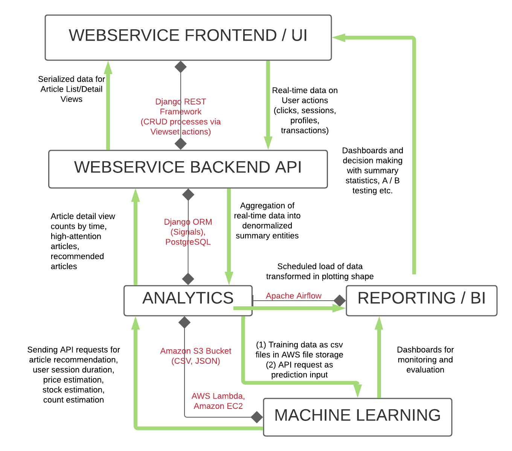
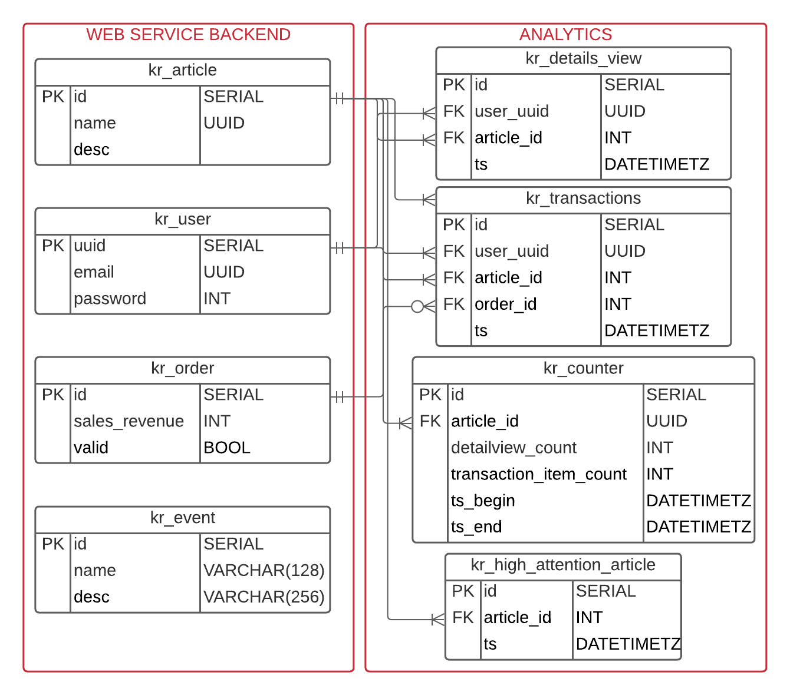

# Case Study: System Design and MVP of Data Operations for an E-Commerce Firm 

## Introduction 
In this project, the architectural aspects of the datawarehousing / predictive analytics strategy for an imaginary E-Commerce firm are outlined. Technical challenges in dealing with high-frequency streaming data are addressed to pave the way for further discussion.
Later, some of the arguments are supported by an MVP implementation of a webservice backend and an analytics pipeline for data aggregation. 

The core elements of the technology stack are Django, Celery-RabbitMQ, and PostgreSQL. The application is then dockerized under the name "e_commerce_app" with persistent storage and mounted volumes.

## Installation
The application e_commerce_app is dockerized, meaning that it can be run by only installing Docker. Docker solves various problems in versioning and deploying any kind of application. Docker-Compose is preferred as the orchestration tool of multiple containers. Docker Compose commands are simplified by a Makefile.

After cloning the Github project, please run the following commands:
* cd e_commerce_app
* make init
PgAdmin is also installed for the ease of access to the resulting database.
It is hosted on localhost:5050. The configuration of pgadmin user name and password, as well as database credentials can be found in .env.dev.

This command will build the containers, set the services up, implement necessary database migrations, seed daily scheduled data, and collect aggregated data for the analytics module.
The process is not optimized and takes around ~30 minutes runtime. It is worth discussing how to speed up the seeding. However, in our case of daily & 4-hourly intervals of update time, that speed is just working fine.

## Case Study
The articles on the E-Commerce firm are visited and bougth by end users. Visits are classified under the event "detailsView" while the buy transactions are under "transaction_item". The aggregated event data for articles are to be analyzed.

Tasks for that raw streaming data:

1. How could the architectural design of such business case be? What services/tools could be integrated? What is the big picture?
2. How could expose a real-time counter of detailsView over the last 4 hours be exposed on the UI?
3. How could higher-attention articles highlighted and shown to the end user?
4. How could the data be aggregated?
5. How could high availability be ensured?
6. How could this system be fed by seed data? How could it be scheduled?
7. What are the major technical challenges in all above tasks?

## Architectural Proposal

The diagram above summarizes the tooling/services with black lines and processes with green arrows. The core modules are Webservice UI, Webservice Backend API, Analytics, Reporting / BI, and Machine Learning. In the MVP phase, only the Webservice Backend API and Analytics modules are simulated.

* **Webservice:** Given the UI, user interacts with the articles either by displaying their detail pages or buying them. The real-time data is collected through the API calls that are requested by the client and received through Django Rest Framework on the server side. Rest Framework viewsets handle CRUD operations and redirect the data to Django Models. They are then stored into the PostgreSQL database via Django ORM. The storage of this flow is done on a 1NF schema design. The reason for this schema choice is the reusability of entities across multiple situations that the data can be collected. In this way, user profiles or geographic data could be collected independently from transactional event data in an efficient way.

* **Analytics:** The data is aggregated here (4th task). The data that is upstreamed through the UI to the Django Models trigger signals (or they can be populated by a task scheduler/message broker) to analytical tables which are denormalized (For instance, the event count is now in two columns, transactional_item_count and details_views_count - More on that in the next section). This causes informational redundancy, but saves us from computational costs of joining entities while sending the data over to other modules. This design with schedulers partly solves the high availability challenge (5th task). 

# MVP
The MVP is a Django application with two modules, webservice and analytics. The 2nd task and 3rd tasks are solved by the following Entity Relationship Diagram below. Django model properties are also used to make relevant queries on them to enrich the article detail page with a real-time counter over last 4 hours and a boolean if the article is a higher-attention article.

The 4th task on how the data is aggregated can be answered by how the entities in the analytics module are populated by the data of the entities in the webservice module. Using DRF, kr_details_view and kr_transactions can be collected through the kr_article model properties which are exposed to the Article API endpoint. The entity kr_counter is then fed by those two tables on a scheduler which is run every 4 hours. Simultaneoulsy, kr_high_attention_article is populated with selecting the 100 most popular items from kr_counter, again every 4 hours (It can also be scheduled on a different interval). These updates are made through the Celery integration with Django, also including RabbitMQ under the hood. The scheduled tasks are written under api.tasks, and the celery configuration can be found under e_commerce.celery.

The reporting table that could be used as the basis for daily management report is currently kr_counter. There, we can compare two random variables of details_view_count and transaction_item_count. This would allow us to work on whether there is a correlation, whether an article which is viewed frequently, is also solved frequently. In addition, causal analysis could be made in an A/B test setting, by tweaking the DRF Viewsets and showing in one url the count of views on the detail page, and not in another url.

Another reporting table could be prepared by merging kr_counter and kr_high_attention_article in another entity. Therefore, it can be analyzed further whether also highlighting the item causes higher transaction.

At last, the system functions as the data flows from the user directly to the analytics database. Those two modules, analytics and webservice might also be disintegrated as separate microservices. In that case, the data can be received in the bulk format as in workspace.data folder. The scripts to read and preprocess this data can be found under api.util.readers and the scripts to parse them into the database can be found under api.util.parsers.
